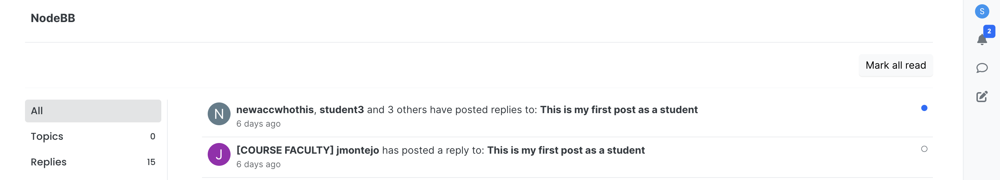
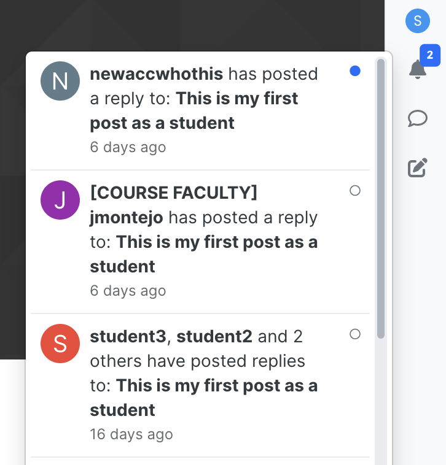
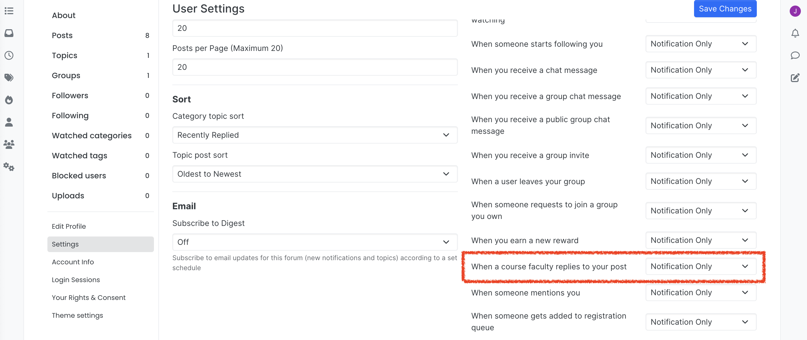
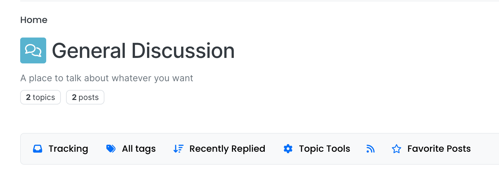
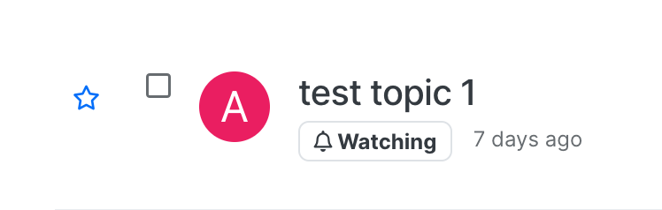

# User Guide for Team SWEethearts User Stories 

## Table of Contents
1. [User Story 2](#user-story-2)
2. [User Story 7](#user-story-7)

## User Story 2
As a student, I want to receive an immediate notification when a course faculty member replies to my post, so that I can review their response within 24 hours.

### Feature Overview
* Real-time notifications: 
    * Push notifications that will appear on the notification side bar and on the main notification page when a course faculty replies to your post.
    
    

    * These notifications are delivered separately from non-faculty reply notifications and are indicated with the "[COURSE-FACULTY]" on the title. (As shown in the above images.)
    

* User Preferences: Like other notifications, users are able to customize their notification settings (choose between push, email, both, or turn both off) in the account settings page.

### How To Use and Test User Story 2 Feature
1. Register 2 accounts: an admin and a non-admin (student). 
2. Log in to the non-admin account and make a topic in a discussion board. 
3. Go to the user settings page by clicking on the top right profile icon then "Settings".
4. Scroll down until you find the course faculty notification setting as shown below. This feature's setting should be on the "Notification Only" by default. Choose your preferred setting and press Save Changes.
5. Log out of this student account and log in to the admin account. 
6. Leave a reply to the student post.
7. Log out and log in the student account. There should now be a new notification that pops up on the notification sidebar and on the page.
* If this setting is turned off then there should be no notifications on the inbox or on the notification page.

**Note: For this feature we assume that every admin account is a course faculty.**

### Automated Tests - located in `test/notifications.js`
#### Test Cases: Lines 392 - 585
* Lines 442 - 448: Testing basic functionality: user should receive a notification when a course faculty replies.
* Lines 450 - 485: Test that user should not receive notification when regular user replies.
* Lines 487 - 535: Test to check that user can mark faculty replies as read.
* Lines 537 - 544: Test to check that changing notification settings work.
* Lines 546 - 571: Test to check that separate faculty replies trigger separate notifications.

#### Test Justification
We believe that these tests are sufficient as it tests the basic functionality of this new feature. The tests ensure that users receive notifications from faculty, can differentiate between faculty and regular user replies, and can manage notifications (e.g., marking them as read or adjusting settings). This ensures both the functionality and user control of the feature, making the system reliable.

## User Story 7
As a student, I want to save posts to favorites for posts that contains important information/good solutions, so that I can review them later on quickly

### Feature Overview
* Adding a Favorites category in the discussion post bar:
    * Users are able to select posts as a Favorite
    * Conceptually, posts marked as Favorites could be sorted and displayed to user
    
    

### How to Use and Test User Story 
1. User needs to register; does not have to be an admin
2. Go to "General Discussion" page
3. There should be at least one topic within the discussion page. If there are none, make a test post.
4. You should be able to see a Star button signifying Favorite
5. There should also be a Favorite button in the post bar
6. The Favorite button in post bar can be toggled on and off.

### Automated tests are located in `test/topics/favorite.js`

#### Error Tests: Testing invalid inputs
* Test for invalid input

#### Valid Tests

#### Test Justification
We believe that these tests are sufficient because 
